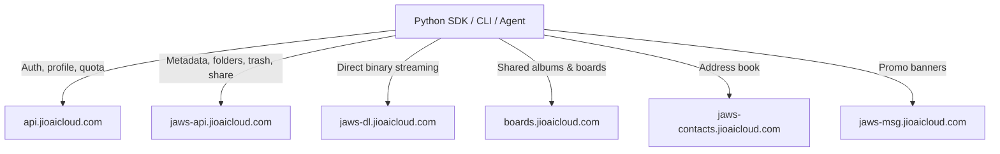

# Unofficial Jio AI Cloud Python SDK & CLI

A high-performance, zero-dependency Python SDK, CLI, and **AI-agent tool
server** for **Jio AI Cloud** storage — protocol-verified against live
production servers.

> ⚠️ **UNOFFICIAL PROJECT.** Not affiliated with, associated with,
> authorized by, endorsed by, or in any way officially connected with
> Reliance Jio Infocomm Ltd. or its subsidiaries. "Jio" / "Jio AI Cloud"
> are trademarks of their respective owners, used here for nominative
> reference only. Built strictly for **personal data portability, backup of
> your OWN account, interoperability, and education** — see
> [DISCLAIMER.md](DISCLAIMER.md) and [LEGAL.md](LEGAL.md) before use.

---

## ✨ Key Capabilities

| Area | Features |
|---|---|
| **Cataloging** | Streaming recursive file walker (10k+ files), directory listings (files/folders), full-text search across names & backup source paths |
| **Downloads** | Single-file streaming with progress callback + atomic `.part` writes, multi-threaded bulk sync with skip-existing & resume-friendly manifests |
| **Management** | Create folder, rename, move, favorite/unfavorite, trash, restore, version history |
| **Sharing** | Public universal links (`https://www.jioaicloud.com/l/?u=…`) for one or many objects |
| **Boards/Albums** | List, create, inspect members, get board details, leave board |
| **Account** | Profile, quota breakdown (docs/photos/videos/audio), devices, promotions, app settings |
| **Extras** | Recent activity feed, spotlights, shared-by-me, DigiLocker linked-app objects, manual tags, Office-web capability matrix, promo banners, contacts |
| **AI Agents** | 16-tool JSON schema (OpenAI/Anthropic function-calling compatible), strict JSON envelope dispatcher, MCP-style stdio server, destructive-op confirmation guard |
| **Robustness** | Automatic retry w/ exponential backoff on 429/5xx/network faults, typed exception taxonomy, per-object error surfacing from batch `unprocessed[]` |
| **Dependencies** | None — pure Python 3.8+ standard library |

Every implemented endpoint was exercised against production; see
[`KNOWN_ISSUES.md`](KNOWN_ISSUES.md) for server quirks discovered on the way
and [`tests/live_verify.py`](tests/live_verify.py) for the reproducible
26-check verification matrix (all passing).

---

## 🏗️ Service Architecture



---

## 📦 Directory Structure

```
jiocloud_client/
├── README.md                  # This file
├── LICENSE                    # MIT + trademark/non-affiliation notice
├── DISCLAIMER.md              # Full legal disclaimers
├── LEGAL.md                   # Compliance summary
├── KNOWN_ISSUES.md            # Verified server behaviors & gaps (contribute!)
├── cli.py                     # Command-line interface (20 commands)
├── config.example.json        # Credential template (placeholders only)
├── jiocloud/                  # Core SDK package
│   ├── __init__.py
│   ├── client.py              # JioCloudClient — 30+ methods, retry engine
│   ├── auth.py                # JioCloudAuth — header construction
│   ├── agent_tools.py         # AI-agent schema, bridge, MCP stdio loop
│   ├── models.py              # Typed dataclasses
│   └── exceptions.py          # Typed error taxonomy
├── docs/
│   ├── API_REFERENCE.md       # Every verified endpoint + payloads
│   ├── AUTHENTICATION.md      # Headers, token extraction, safety
│   ├── DATA_MODELS.md         # JSON schemas
│   └── ERROR_CODES.md         # Server error codes seen in production
├── examples/
│   ├── 01_quickstart.py
│   ├── 02_list_and_search.py
│   ├── 03_batch_download.py
│   ├── 04_folder_and_trash_management.py
│   ├── 05_share_links.py
│   ├── 06_agent_integration.py   # LLM/MCP tool-calling demo
│   ├── 07_incremental_backup.py  # Manifest-based delta backup
│   └── 08_inventory_export.py    # CSV/JSON export + analytics
└── tests/
    ├── test_models.py            # Offline unit tests
    ├── test_client.py            # Live integration tests
    └── live_verify.py            # 26-check live verification matrix
```

---

## 🚀 Quickstart

### 1. Configuration

Copy `config.example.json` → `config.json` and fill in **your own** session
credentials (see [docs/AUTHENTICATION.md](docs/AUTHENTICATION.md) for how to
extract them from your browser session):

```json
{
  "auth_token": "Basic YOUR_BASE64_SESSION_TOKEN_HERE",
  "user_id": "YOUR_32_CHAR_USER_ID_HEX",
  "device_key": "YOUR_DEVICE_KEY_UUID",
  "api_key": "c153b48e-d8a1-48a0-a40d-293f1dc5be0e",
  "app_secret": "ODc0MDE2M2EtNGY0MC00YmU2LTgwZDUtYjNlZjIxZGRkZjlj",
  "client_details": "clientType:WEB; appVersion:86.0.1",
  "device_type": "W",
  "accept_language": "en-US,en;q=0.9"
}
```

> `api_key` / `app_secret` are public web-app constants, not secrets.
> Never commit or share `config.json`. Environment variables
> (`JIOCLOUD_AUTH_TOKEN`, `JIOCLOUD_USER_ID`, `JIOCLOUD_DEVICE_KEY`) work too.

### 2. Python SDK

```python
from jiocloud import JioCloudClient, format_bytes

client = JioCloudClient.from_config("config.json")

profile = client.get_user_profile()
q = profile.quota
print(f"{profile.name}: {q.total_used_gb:.1f}/{q.total_allocated_gb:.0f} GB")

# Stream every file in the account
for f in client.stream_all_files():
    print(f.object_name, f.human_size)

# Search everywhere, then download matches
for hit in client.search_files("invoice", filter_extension="pdf")[:5]:
    client.download_file(hit.object_key, f"./{hit.object_name}")
```

### 3. CLI

```bash
python cli.py info                 # account overview + usage bar
python cli.py list --limit 20     # list root files
python cli.py tree                # recursive tree view
python cli.py search resume --ext pdf
python cli.py download <key> -d ./out/
python cli.py sync --dest ./backup --workers 6
python cli.py mkdir Reports
python cli.py rename <key> "new name.pdf"
python cli.py move <key> <folder-key>
python cli.py favorite <key>
python cli.py share <key>          # public link
python cli.py versions <key>       # version history
python cli.py recent               # recent activity feed
python cli.py boards list|create|members
python cli.py contacts             # address book summary
python cli.py promotions           # storage promos
python cli.py trash <key> / restore <key> / trash-list
```

### 4. AI Agent Integration

```bash
# Dump the 16-tool JSON schema into any LLM's tools parameter
python cli.py agent schema

# One-shot structured call (strict JSON envelope)
python cli.py agent call '{"tool":"search_files","arguments":{"query":"tax","extension":"pdf"}}'

# MCP-style stdio server loop for agent hosts
python cli.py agent serve
```

Envelope contract:

```jsonc
// request
{"tool": "<name>", "arguments": {...}}
// response — success
{"ok": true, "result": ...}
// response — failure (never a raw traceback)
{"ok": false, "error": {"type": "...", "message": "..."}}
// destructive tools (download_file, download_all, move_to_trash,
// restore_from_trash, share_link) REQUIRE arguments.confirm === true
```

See [`examples/06_agent_integration.py`](examples/06_agent_integration.py)
and [`docs/API_REFERENCE.md`](docs/API_REFERENCE.md § Agent Tools).

---

## 🧪 Verification

```bash
# Offline unit tests
python -m unittest discover -s tests

# FULL live matrix against production (requires config.json).
# Exercises every read endpoint plus a complete create→rename→favorite→
# trash→restore→trash cycle and a real small-file download.
python tests/live_verify.py
```

Latest run: **26/26 passed** against production (2026-08-25).

---

## 📖 Documentation

- [API Reference](docs/API_REFERENCE.md) — endpoints, params, payloads, response shapes
- [Authentication](docs/AUTHENTICATION.md) — header contract & credential safety
- [Data Models](docs/DATA_MODELS.md) — entity schemas
- [Error Codes](docs/ERROR_CODES.md) — production error taxonomy & handling
- [Known Issues](KNOWN_ISSUES.md) — server quirks, gaps, how to contribute fixes

---

## ⚖️ Legal

- [LICENSE](LICENSE) — MIT + trademark/non-affiliation notice
- [DISCLAIMER.md](DISCLAIMER.md) — AS-IS warranty, liability limits, personal-backup clause, privacy notice
- [LEGAL.md](LEGAL.md) — compliance summary & takedown contact

**Summary**: independent unofficial tool · personal data portability &
education only · no warranty · you are responsible for compliance with
Jio's terms for your account · credentials never leave your machine except
to official `*.jioaicloud.com` endpoints over TLS · zero telemetry.
