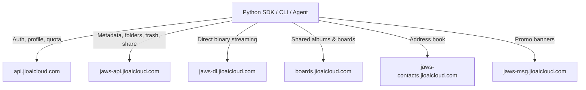

# Unofficial Jio AI Cloud Python SDK, CLI & AI-Agent Tools


[](https://ns81000.github.io/jiocloud_client/)

[](https://github.com/Ns81000/jiocloud_client/actions/workflows/deploy-docs.yml)

> **UNOFFICIAL PROJECT.** Not affiliated with, associated with, authorized
> by, endorsed by, or in any way officially connected with Reliance Jio
> Infocomm Ltd. or its subsidiaries. "Jio" / "Jio AI Cloud" are trademarks of
> their respective owners, used here for nominative reference only.

> **UNSTABLE TARGET — Last verified: 2026-08-25 (26/26 checks passed).**
> Jio AI Cloud has no public API. Endpoints change without notice and can
> break at any time. Verified against production on 2026-08-25 (26/26 checks).
> Features may stop working at any moment — check
> [docs/KNOWN_ISSUES.md](docs/KNOWN_ISSUES.md) for current status.

A high-performance, zero-dependency Python SDK, CLI, and **AI-agent tool
server** for **Jio AI Cloud** storage — protocol knowledge reverse-engineered
from live network traffic of the owner's own account. Built strictly for
**personal data portability, backup of your OWN account, interoperability,
and education** — see [docs/DISCLAIMER.md](docs/DISCLAIMER.md) and
[docs/LEGAL.md](docs/LEGAL.md) before use.

Documentation site: <https://ns81000.github.io/jiocloud_client/>

---

## Key Capabilities

| Area | Features |
|---|---|
| **Cataloging** | Streaming recursive file walker (2200+ files tested), directory listings (files/folders), full-text search across names & backup source paths |
| **Downloads** | Chunked atomic downloads with progress callbacks, MD5 verified against server hash, multi-threaded bulk sync with skip-existing |
| **Management** | Create folder, rename, move, favorite/unfavorite, trash, restore, version history |
| **Sharing** | Public universal links (`https://www.jioaicloud.com/l/?u=...`) for one or many objects |
| **Boards/Albums** | List, create, inspect members, get board details, leave board |
| **Account** | Profile, quota breakdown (docs/photos/videos/audio), devices, promotions, app settings |
| **Feeds** | Recent activity feed, spotlights, shared-by-me, DigiLocker linked-app objects, manual tags |
| **AI Agents** | 16-tool JSON schema (OpenAI/Anthropic function-calling compatible), strict JSON envelope dispatcher, destructive-op confirmation guard, MCP-style stdio server |
| **Robustness** | Retry with exponential backoff on 429/5xx/network faults, typed exception taxonomy, per-object error surfacing from batch `unprocessed[]` |
| **Dependencies** | None — pure Python 3.8+ standard library |

Every implemented endpoint was exercised against production; see
[`docs/KNOWN_ISSUES.md`](docs/KNOWN_ISSUES.md) for server quirks discovered
on the way and [`tests/live_verify.py`](tests/live_verify.py) for the
reproducible 26-check verification matrix (all passing as of 2026-08-25).

---

## Service Architecture



---

## Directory Structure

```
jiocloud_client/
├── README.md                  # This file
├── LICENSE                    # MIT + trademark/non-affiliation notice
├── CHANGELOG.md               # Release history with verification stamps
├── CONTRIBUTING.md            # Broken-endpoint reports, capture-based fixes
├── cli.py                     # Command-line interface (20 commands)
├── config.example.json        # Credential template (placeholders only)
├── mkdocs.yml                 # Documentation site config (GitHub Pages)
├── llms.txt / llms-full.txt   # LLM-oriented documentation indexes
├── jiocloud/                  # Core SDK package
│   ├── client.py              # JioCloudClient — 30+ methods, retry engine
│   ├── auth.py                # JioCloudAuth — header construction
│   ├── agent_tools.py         # AI-agent schema, bridge, MCP stdio loop
│   ├── models.py              # Typed dataclasses
│   └── exceptions.py          # Typed error taxonomy
├── docs/                      # Also rendered at ns81000.github.io/jiocloud_client
│   ├── API_REFERENCE.md       # Every verified endpoint + payloads
│   ├── AUTHENTICATION.md      # Headers, token extraction, safety
│   ├── GET_CREDENTIALS.md     # Credential walkthrough (console one-paste)
│   ├── DATA_MODELS.md         # JSON schemas
│   ├── ERROR_CODES.md         # Server error codes seen in production
│   ├── KNOWN_ISSUES.md        # Verified server behaviors & gaps (contribute!)
│   ├── DISCLAIMER.md          # Full legal disclaimers
│   └── LEGAL.md               # Compliance summary
├── ai/                        # AI integration assets
│   ├── skills/jio-cloud-manager/SKILL.md
│   ├── tools/openai-function-schema.json
│   ├── tools/anthropic-tools.json
│   ├── prompts/system-prompt.txt
│   └── examples/agent-conversation.md
├── examples/                  # 01_quickstart ... 08_inventory_export (+ setup_credentials.py)
└── tests/
    ├── test_models.py         # Offline unit tests
    ├── test_client.py         # Live integration tests
    └── live_verify.py         # 26-check live verification matrix
```

---

## Quickstart

### 1. Configuration

The easiest path: copy one request as cURL from your browser's Network tab
(filter: `domain:api.jioaicloud.com security/users -method:OPTIONS`), then run:

```bash
python examples/setup_credentials.py --from-curl
```

It reads the cURL from your clipboard, validates the session live, and writes
`config.json`. Full walkthrough (including a one-paste browser console
extractor): **[docs/GET_CREDENTIALS.md](docs/GET_CREDENTIALS.md)**.

Manual alternative: copy `config.example.json` to `config.json` and fill in
**your own** session credentials:

```json
{
  "auth_token": "Basic YOUR_BASE64_SESSION_TOKEN_HERE",
  "user_id": "YOUR_32_CHAR_USER_ID_HEX",
  "device_key": "YOUR_DEVICE_KEY_UUID",
  "api_key": "c153b48e-d8a1-48a0-a40d-293f1dc5be0e",
  "app_secret": "ODc0MDE2M2EtNGY0MC00YmU2LTgwZDUtYjNlZjIxZGRkZjlj",
  "client_details": "clientType:WEB; appVersion:86.0.1",
  "device_type": "W",
  "accept_language": "en-US,en;q=0.9"
}
```

> `api_key` / `app_secret` are public web-app constants, not secrets.
> Never commit or share `config.json`. Environment variables
> (`JIOCLOUD_AUTH_TOKEN`, `JIOCLOUD_USER_ID`, `JIOCLOUD_DEVICE_KEY`) work too.

### 2. Python SDK

```python
from jiocloud import JioCloudClient, format_bytes

client = JioCloudClient.from_config("config.json")

profile = client.get_user_profile()
q = profile.quota
print(f"{profile.name}: {q.total_used_gb:.1f}/{q.total_allocated_gb:.0f} GB")

# Stream every file in the account
for f in client.stream_all_files():
    print(f.object_name, f.human_size)

# Search everywhere, then download matches
for hit in client.search_files("invoice", filter_extension="pdf")[:5]:
    client.download_file(hit.object_key, f"./{hit.object_name}")
```

### 3. CLI

```bash
python cli.py info                 # account overview + usage bar
python cli.py list --limit 20      # list root files
python cli.py tree                 # recursive tree view
python cli.py search resume --ext pdf
python cli.py download <key> -d ./out/
python cli.py sync --dest ./backup --workers 6
python cli.py mkdir Reports
python cli.py rename <key> "new name.pdf"
python cli.py move <key> <folder-key>
python cli.py favorite <key>
python cli.py share <key>          # public link
python cli.py versions <key>       # version history
python cli.py recent               # recent activity feed
python cli.py boards list|create|members
python cli.py contacts             # address book summary
python cli.py promotions           # storage promos
python cli.py trash <key> / restore <key> / trash-list
```

### 4. AI Agent Integration

```bash
# Dump the 16-tool JSON schema into any LLM's tools parameter
python cli.py agent schema

# One-shot structured call (strict JSON envelope)
python cli.py agent call '{"tool":"search_files","arguments":{"query":"tax","extension":"pdf"}}'

# MCP-style stdio server loop for agent hosts
python cli.py agent serve
```

Envelope contract:

```jsonc
// request
{"tool": "<name>", "arguments": {...}}
// response — success
{"ok": true, "result": ...}
// response — failure (never a raw traceback)
{"ok": false, "error": {"type": "...", "message": "..."}}
// destructive tools (download_file, download_all, move_to_trash,
// restore_from_trash, share_link) REQUIRE arguments.confirm === true
```

See [`examples/06_agent_integration.py`](examples/06_agent_integration.py)
and [`ai/examples/agent-conversation.md`](ai/examples/agent-conversation.md).

### 5. Installing the AI assets

Everything an assistant needs to operate this SDK is pre-built in [`ai/`](ai/):

| Asset | Install into |
|---|---|
| [`ai/skills/jio-cloud-manager/SKILL.md`](ai/skills/jio-cloud-manager/SKILL.md) | Claude (as a skill/project knowledge), or any assistant that accepts a markdown instruction doc |
| [`ai/tools/openai-function-schema.json`](ai/tools/openai-function-schema.json) | ChatGPT / any OpenAI-compatible host: pass the `tools` array in your API request |
| [`ai/tools/anthropic-tools.json`](ai/tools/anthropic-tools.json) | Claude API: pass as the `tools` array |
| [`ai/prompts/system-prompt.txt`](ai/prompts/system-prompt.txt) | Any LLM: paste as the system prompt alongside the tool schemas |
| [`llms-full.txt`](https://ns81000.github.io/jiocloud_client/llms-full.txt) | Any agent that fetches context from a URL — complete docs in one file |

For local agents, expose the SDK as a tool server:

```bash
python cli.py agent serve
```

Then wire your MCP-style host to send one JSON line per call:
`{"tool": "...", "arguments": {...}}` and read one strict-JSON envelope back.

---

## Verification

```bash
# Offline unit tests
python -m unittest discover -s tests

# FULL live matrix against production (requires config.json).
# Exercises every read endpoint plus a complete create→rename→favorite→
# trash→restore→trash cycle and a real small-file download.
python tests/live_verify.py
```

Latest run: **26/26 passed** against production (**2026-08-25**).

---

## Documentation

Site: <https://ns81000.github.io/jiocloud_client/>

- [Getting Credentials](docs/GET_CREDENTIALS.md) — extract + validate session values
- [Authentication](docs/AUTHENTICATION.md) — header contract & credential safety
- [API Reference](docs/API_REFERENCE.md) — endpoints, params, payloads, response shapes
- [Data Models](docs/DATA_MODELS.md) — entity schemas
- [Error Codes](docs/ERROR_CODES.md) — production error taxonomy & handling
- [Known Issues](docs/KNOWN_ISSUES.md) — server quirks, gaps, how to contribute fixes
- [Changelog](CHANGELOG.md) · [Contributing](CONTRIBUTING.md)
- [llms.txt](llms.txt) / [llms-full.txt](llms-full.txt) — for AI agents

---

## Legal

- [LICENSE](LICENSE) — MIT + trademark/non-affiliation notice
- [DISCLAIMER.md](docs/DISCLAIMER.md) — AS-IS warranty, liability limits, personal-backup clause, privacy notice
- [LEGAL.md](docs/LEGAL.md) — compliance summary & takedown contact

**Summary**: independent unofficial tool · personal data portability &
education only · no warranty · you are responsible for compliance with
Jio's terms for your account · credentials never leave your machine except
to official `*.jioaicloud.com` endpoints over TLS · zero telemetry.
