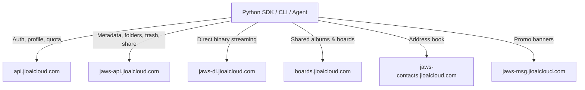

# Unofficial Jio AI Cloud Python SDK, CLI & AI-Agent Tool Server

A high-performance, **zero-dependency** (Python 3.8+ stdlib only) SDK, CLI,
and AI-agent tool server for Jio AI Cloud storage — protocol knowledge
reverse-engineered from the owner's own account traffic and verified against
live production servers.

!!! danger "UNSTABLE TARGET — Last verified: 2026-08-25 (26/26 checks passed)"

    Jio AI Cloud has **no public API**. Endpoints change without notice and can
    break at any time. Verified against production on **2026-08-25 (26/26
    checks)**. Features may stop working at any moment — check
    [KNOWN_ISSUES.md](KNOWN_ISSUES.md) for current status.

> **UNOFFICIAL PROJECT.** Not affiliated with, associated with, authorized by,
> endorsed by, or in any way officially connected with Reliance Jio Infocomm
> Ltd. or its subsidiaries. "Jio" / "Jio AI Cloud" are trademarks of their
> respective owners, used for nominative reference only. Built strictly for
> personal data portability, backup of your OWN account, interoperability, and
> education — see [DISCLAIMER.md](DISCLAIMER.md) and [LEGAL.md](LEGAL.md).

[Get started](GET_CREDENTIALS.md){ .md-button .md-button--primary }
[Browse the API](API_REFERENCE.md){ .md-button }

## Feature Matrix

| Area | Features |
|---|---|
| **Cataloging** | Streaming recursive file walker (2200+ files tested), directory listings (files/folders), full-text search across names & backup source paths |
| **Downloads** | Chunked atomic downloads with progress callbacks, MD5 verified against server hash, multi-threaded bulk sync with skip-existing |
| **Management** | Create folder, rename, move, favorite/unfavorite, trash, restore, version history |
| **Sharing** | Public universal links (`https://www.jioaicloud.com/l/?u=...`) for one or many objects |
| **Boards/Albums** | List, create, inspect members, get board details, leave board |
| **Account** | Profile, quota breakdown (docs/photos/videos/audio), devices, promotions, app settings |
| **Feeds** | Recent objects, spotlights, shared-by-me, DigiLocker linked-app objects, manual tags |
| **AI Agents** | 16-tool JSON schema (OpenAI/Anthropic function-calling compatible), strict JSON envelope dispatcher, destructive-op confirmation guard, MCP-style stdio server |
| **Robustness** | Retry with exponential backoff on 429/5xx/network faults, typed exception taxonomy, per-object error surfacing from batch `unprocessed[]` |
| **Dependencies** | None — pure Python 3.8+ standard library |

## Quickstart

```bash
# 1. Extract credentials from your own web session and validate them
python examples/setup_credentials.py

# 2. Verify the connection
python cli.py info

# 3. Back up everything
python cli.py sync --dest ./backup --workers 6
```

Full walkthrough: [Getting Credentials](GET_CREDENTIALS.md).

## Architecture



## Verification Status

Latest live verification run: **2026-08-25 — 26/26 checks passed** against
production with a free-tier account (~39 GB used of 100 GB). The reproducible
matrix lives in [`tests/live_verify.py`](https://github.com/Ns81000/jiocloud_client/blob/main/tests/live_verify.py).
Run it yourself:

```bash
python tests/live_verify.py
```

## AI Integration Assets

Ready-made assets for wiring this SDK into any LLM agent:

- [`ai/skills/jio-cloud-manager/SKILL.md`](https://github.com/Ns81000/jiocloud_client/tree/main/ai/skills/jio-cloud-manager) — installable AI skill
- [`ai/tools/openai-function-schema.json`](https://github.com/Ns81000/jiocloud_client/blob/main/ai/tools/openai-function-schema.json) — OpenAI function-calling schema
- [`ai/tools/anthropic-tools.json`](https://github.com/Ns81000/jiocloud_client/blob/main/ai/tools/anthropic-tools.json) — Anthropic tool-use schema
- [`ai/prompts/system-prompt.txt`](https://github.com/Ns81000/jiocloud_client/blob/main/ai/prompts/system-prompt.txt) — paste-ready operational system prompt
- [`llms.txt`](https://ns81000.github.io/jiocloud_client/llms.txt) / [`llms-full.txt`](https://ns81000.github.io/jiocloud_client/llms-full.txt) — LLM-oriented index and single-file full context

## Badges


## Legal Summary

Independent unofficial tool · personal data portability & education only · no
warranty · you are responsible for compliance with Jio's terms for your
account · credentials never leave your machine except to official
`*.jioaicloud.com` endpoints over TLS · zero telemetry. Full text in
[DISCLAIMER.md](DISCLAIMER.md), [LEGAL.md](LEGAL.md), and the [LICENSE](https://github.com/Ns81000/jiocloud_client/blob/main/LICENSE).
